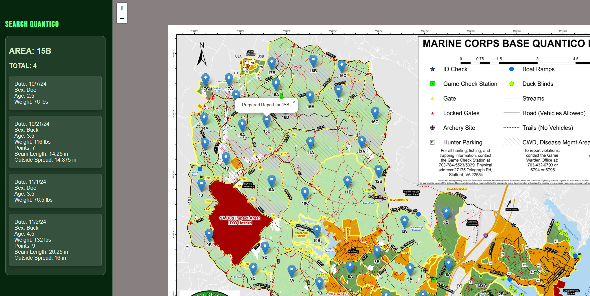

# Quantico Harvest Map


## Table of Contents

- [Project Overview](#project-overview)
- [Features](#features)
- [Technologies Used](#technologies-used)
- [Usage](#usage)
- [Contributing](#contributing)
- [License](#license)

## Project Overview
A web-based interactive map for viewing and exploring deer harvest data on Marine Corps Base Quantico. This application provides real-time insights into harvest data, detailed area information, and interactive features for an engaging user experience.

## Features
- Interactive map powered by Leaflet.js.
- Clickable markers that display detailed harvest information (e.g., date, weight, points).
- Search functionality for locating specific hunting areas.
- Responsive design for both desktop and mobile users.
- Dynamic sidebar displaying detailed information for each selected marker.

## Technologies Used

- Frontend:
HTML5, CSS3, JavaScript

- Leaflet.js for mapping and geospatial visualization
- Google Fonts (Roboto, Bebas Neue)
- Deployment:
Hosted on Render
- Tooling:
Node.js for managing dependencies

## Usage
- For Local Development:
    1. Clone the repository 
    2. Run npm install
    3. Left click index.html and click Open with Live Server or Open with Default Browser

- For Production:
Visit the live application hosted on Render: **[Quantico Harvest Map](https://quanticoharvest.onrender.com/)**


## Contributing

Contributions are welcome! If you have suggestions or would like to improve this application, please follow these steps:

1. Fork the repository.

2. Create a new branch 
```bash
git checkout -b feature/YourFeature.
```
3. Commit your changes 
```bash
git commit -m 'Add your feature'.
```

4. Push to the branch 
```bash
git push origin feature/YourFeature.
```

5. Open a Pull Request.

## License

This project is licensed under the MIT License. See the LICENSE file for details.